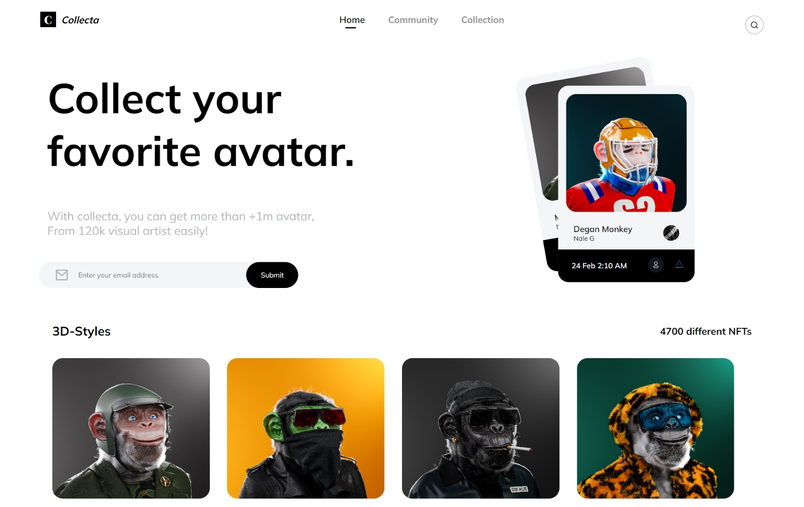

# Collecta Crypto UI

This design is created for challenge given by sheryians coding school.

<i>Responsive for Desktop only.</i>

## 🔗 Links

## 🔗 Website

## Inspiration 

Design is inspired from dribbble

Thanks to '<i>Piqo Design</i>' for this awesome design.
